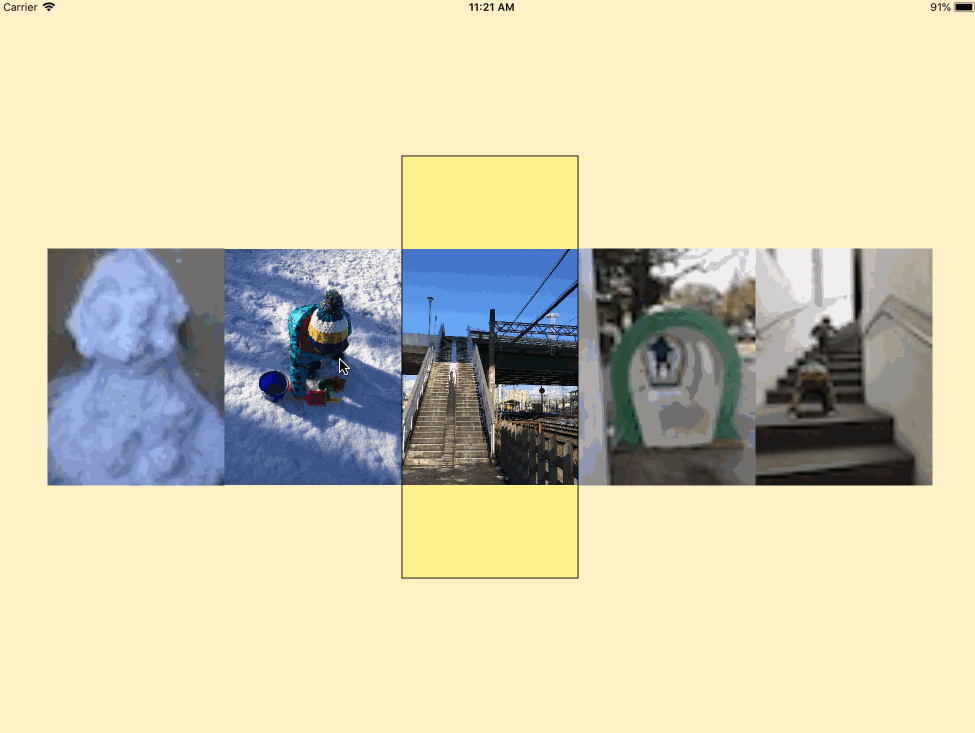

# ReusableScrollView
UIScrollView for page enabled content with reusable views. Perfect for scrolling images or other content that require greater memory management

## Introduction
ReusableScrollView is an easy to use library meant to optimize displaying and scrolling images in pageing enabled UIScrollView. This library is intended for devices with iOS 11's on board. It exposes a simple API that allows you to use in any UIViewController.


## Installation

Note: Because this project is still under beta release it does not support neither `Cocoapods` nor `Carthage` on this stage

#### Manual Installation

Simply copy the `ReusableScrollView` folder into your file structure where project is. Import `ReusableScrollView.xcodeproj` to the project in XCode and link it with the actual app roject

#### Code integration



In order to integrate in your code make sure you use `ReusableScrollView` instead of  `UIScrollView`. You can achieve this within a code and also in storyboard. `ReusableScrollView` provides 2 protocols that your object needs to conform in order to make it working. The protocols are `ReusableScrollViewDelegate` and `ReusableScrollViewDataSource`. The concept of implementation is very similar to the concept of `UITableView`. The implementation of protocols is all you need in order to make it workig.

##### Swift example:

```
extension ViewController: ReusableScrollViewDelegate, ReusableScrollViewDataSource {
    
    var focusDelay:TimeInterval {
        return 0.5
    }
    
    var initialIndex: Int {
        return 7
    }
    
    var numberOfViews: UInt {
        return 12
    }
    
    func reusableViewDidFocus(reusableView:ReusableView) -> Void {
        guard reusableView.absoluteIndex >= 0 else {
            return
        }
        
        guard let contentView = reusableView.contentView as? UIImageView else {
            return
        }
        
        contentView.image = image(at: UInt(reusableView.absoluteIndex))
    }
    
    func scrollViewDidRequestView(reusableScrollView: ReusableScrollView, atIndex: Int) -> UIView {
        // In this case first check the reusable view exists already
        let reusableView = reusableScrollView.reusableView(atAbsoluteIndex: atIndex)
        
        // Confirm the content view is type of `UIimageView`
        guard
            let contentView = reusableView?.contentView as? UIImageView
            else {
                
                let thumbs = thumb(at: UInt(atIndex))
                let imageView = UIImageView(image: thumbs)
                imageView.contentMode = .scaleAspectFit
                
                return imageView;
        }
        
        contentView.image = thumb(at: UInt(reusableView!.absoluteIndex))
        return contentView;
        
    }
}
```

**Note:** *image(at: UInt) and thumb(at: UInt) functions are not coverd in this example*

**More:** *Please check sample applications in the repository for more info*

###### ReusableScrollViewDataSource:

 - `focusDelay` - Asks the data source to return the delay time after which the current view will be replaced. Provide value 0 to invalidate delay.

 - `initialIndex` - Required to define starting index of the scroll view.

 - `numberOfViews` - Asks the data source to return the number of views in the reusable scroll view.

###### ReusableScrollViewDelegate:

 - `scrollViewDidRequestView(reusableScrollView:ReusableScrollView, atIndex:Int) -> UIView` 
 	Called every time when the view needs to be represented by index that is not included in the pool.
     I.e. It is called in the initialization step for all the views necessary.
     If the number of views is 10 and current index is 3 it will be called 5 times - 2 for previous views, 1 for current and 2 for following views.
     
     When scroll view is scrolled in whichever direction, it will call the method (if necessary) to request the view for new index in the pool.
     Use this method to set up placeholder view .

 - `reusableViewDidFocus(reusableView:ReusableView) -> Void` 

	This delegate method is called for every visible view after `focus delay` time elapsed. If the view is scrolled to the next view before `focus delay` has elapsed this method will not be called. Use this method to replace placeholder view with active view